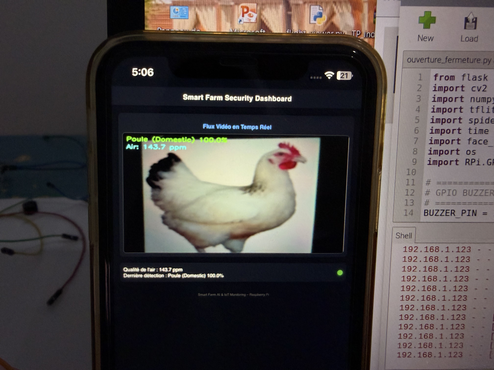
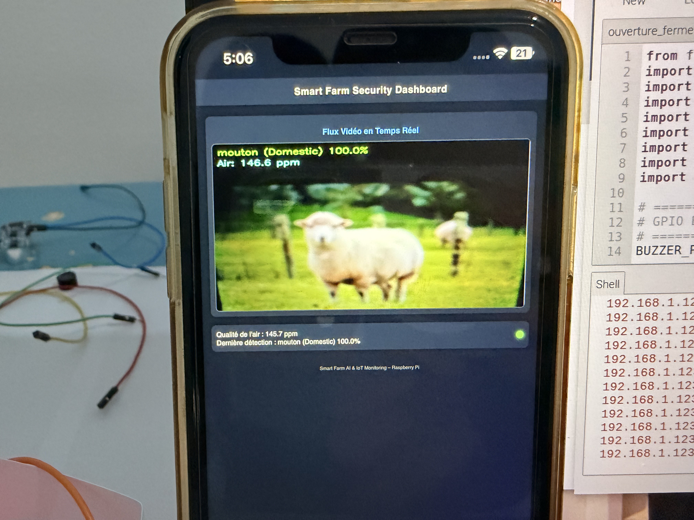
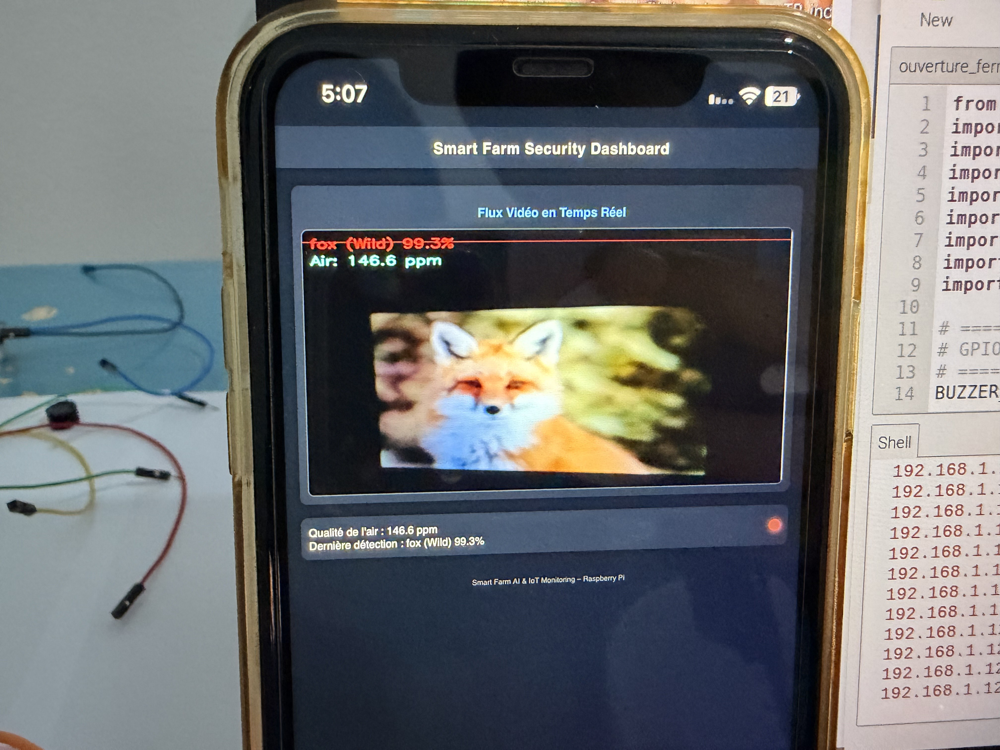
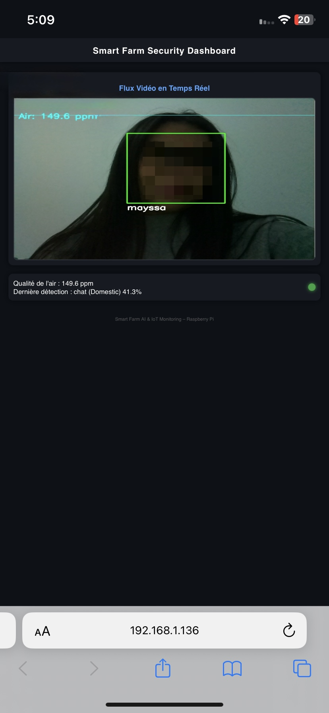
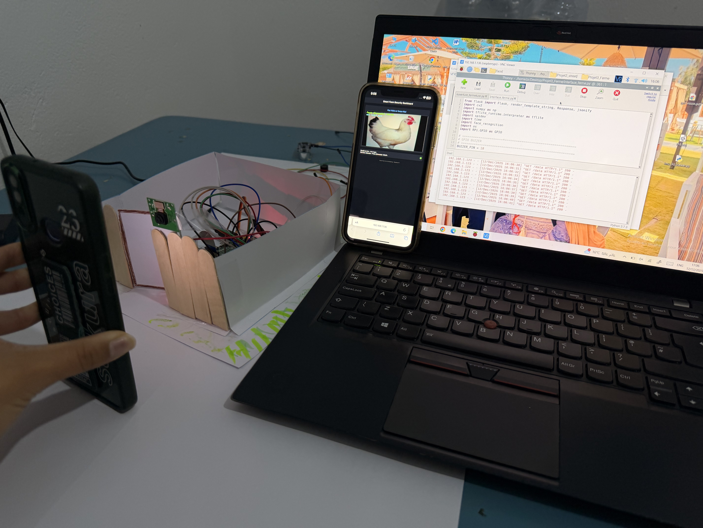

# 🐔 Smart Farm Security — Système de vidéosurveillance intelligente pour exploitations agricoles

Système embarqué de vision par ordinateur et d'IoT pour la sécurisation d'une ferme, développé sur **Raspberry Pi**. Le système analyse en temps réel le flux vidéo d'une caméra pour classifier les animaux (sauvages/domestiques), détecter les intrusions humaines par reconnaissance faciale, surveiller la qualité de l'air, et déclencher des alertes automatiques — le tout supervisé via un dashboard web.

---

## 🎯 Objectif du projet

Surveiller une ferme de manière autonome afin de :
- Distinguer les animaux domestiques des animaux sauvages potentiellement dangereux
- Détecter les intrusions humaines non autorisées
- Suivre en continu la qualité de l'air
- Déclencher une alarme sonore en cas de danger
- Centraliser la supervision sur une interface web accessible à distance

---

## ⚙️ Fonctionnalités

| Fonctionnalité | Description |
|---|---|
| 🐾 Classification d'animaux | Modèle TensorFlow Lite (MobileNetV2) classifiant 11 espèces, réparties en `sauvage` / `domestique`, avec pondération pour prioriser la détection des espèces à risque |
| 👤 Reconnaissance faciale | Identification des visages connus (`face_recognition`) et signalement de toute personne non reconnue comme intrusion |
| 🌫️ Qualité de l'air | Lecture analogique d'un capteur MQ135 via un convertisseur ADC MCP3002 (communication SPI) |
| 🔔 Alerte automatique | Déclenchement d'un buzzer (GPIO) en cas d'animal sauvage détecté ou d'intrusion |
| 🌐 Dashboard temps réel | Interface web (Flask) affichant le flux vidéo annoté, la qualité de l'air et la dernière détection, rafraîchie automatiquement |

---

## 🛠️ Matériel utilisé

- Raspberry Pi 4
- Module caméra Raspberry Pi
- Capteur de qualité d'air MQ135
- Convertisseur analogique-numérique MCP3002 (interface SPI)
- Buzzer (GPIO)

---

## 🧠 Stack technique

- **Langage** : Python
- **Vision par ordinateur** : OpenCV, TensorFlow Lite, MobileNetV2
- **Reconnaissance faciale** : `face_recognition`
- **Capteurs / IoT** : SPI (spidev), GPIO (RPi.GPIO)
- **Interface web** : Flask (streaming vidéo HTTP/MJPEG)

---

## 📸 Démonstration

### Détection d'animaux domestiques



### Détection d'un animal sauvage → déclenchement de l'alerte


### Reconnaissance faciale — identification d'une personne autorisée


### Montage matériel


---

## 📂 Structure du projet

```
smart-farm-security/
├── Controle_Ferme.py        # Script principal (détection, capteurs, serveur Flask)
├── animal_classifier.tflite # Modèle de classification (non inclus, à ajouter)
├── known_faces/              # Visages autorisés pour la reconnaissance faciale
├── screenshots/               # Captures d'écran de démonstration
└── README.md
```

---

## 👤 Auteure

**Mayssa Jarray** — Ingénieure en systèmes embarqués & IoT
[LinkedIn](https://www.linkedin.com/in/mayssa-jarray/) · [GitHub](https://github.com/mayssajr)
